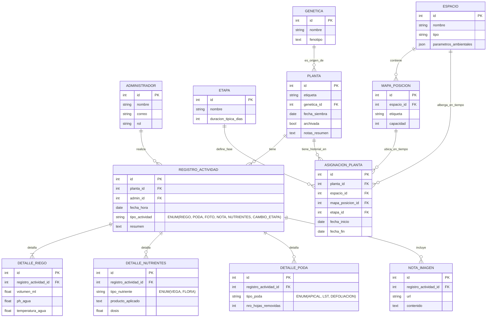

### ERD (Modelo de Datos) - Formato Mermaid

```mermaid
erDiagram
    ADMINISTRADOR {
      int id PK
      string nombre
      string correo
      string rol
    }

    GENETICA {
      int id PK
      string nombre
      text fenotipo
    }

    ETAPA {
      int id PK
      string nombre
      int duracion_tipica_dias
    }

    ESPACIO {
      int id PK
      string nombre
      string tipo
      json parametros_ambientales
    }

    MAPA_POSICION {
      int id PK
      int espacio_id FK
      string etiqueta
      int capacidad
    }

    PLANTA {
      int id PK
      string etiqueta
      int genetica_id FK
      date fecha_siembra
      bool archivada
      text notas_resumen
    }

    ASIGNACION_PLANTA {
      int id PK
      int planta_id FK
      int espacio_id FK
      int mapa_posicion_id FK
      int etapa_id FK
      date fecha_inicio
      date fecha_fin
    }

    REGISTRO_ACTIVIDAD {
      int id PK
      int planta_id FK
      int admin_id FK
      date fecha_hora
      string tipo_actividad "ENUM(RIEGO, PODA, FOTO, NOTA, NUTRIENTES, CAMBIO_ETAPA)"
      text resumen
    }

    DETALLE_RIEGO {
      int id PK
      int registro_actividad_id FK
      float volumen_ml
      float ph_agua
      float temperatura_agua
    }

    DETALLE_NUTRIENTES {
      int id PK
      int registro_actividad_id FK
      string tipo_nutriente "ENUM(VEGA, FLORA)"
      text producto_aplicado
      float dosis
    }

    DETALLE_PODA {
      int id PK
      int registro_actividad_id FK
      string tipo_poda "ENUM(APICAL, LST, DEFOLIACION)"
      int nro_hojas_removidas
    }

    NOTA_IMAGEN {
      int id PK
      int registro_actividad_id FK
      string url
      text contenido
    }

    PLANTA ||--o{ REGISTRO_ACTIVIDAD : "tiene"
    PLANTA ||--o{ ASIGNACION_PLANTA : "tiene_historial_en"
    ADMINISTRADOR ||--o{ REGISTRO_ACTIVIDAD : "realiza"

    GENETICA ||--o{ PLANTA : "es_origen_de"
    ETAPA ||--o{ ASIGNACION_PLANTA : "define_fase"

    ESPACIO ||--o{ MAPA_POSICION : "contiene"
    ESPACIO ||--o{ ASIGNACION_PLANTA : "alberga_en_tiempo"
    MAPA_POSICION ||--o{ ASIGNACION_PLANTA : "ubica_en_tiempo"

    REGISTRO_ACTIVIDAD ||--|{ DETALLE_RIEGO : "detalla"
    REGISTRO_ACTIVIDAD ||--o{ DETALLE_NUTRIENTES : "detalla"
    REGISTRO_ACTIVIDAD ||--o{ DETALLE_PODA : "detalla"
    REGISTRO_ACTIVIDAD ||--o{ NOTA_IMAGEN : "incluye"
```
