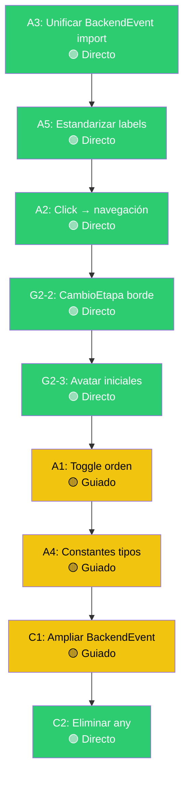

# 📋 KANBAN — Sprint H: Flores Delta MVP
## Fecha: 2 Mar 2026 | Sesión: Integración de Contexto

> **Regla:** Ninguna tarea se ejecuta sin pasar por su nivel del Método de Desarrollo v3.
> Cada ticket tiene su clasificación de complejidad (🟢🟡🔴), fase actual, y archivos involucrados.

---

## ✅ CERRADO — Sprint G2 (27 Feb 2026)

| Ticket | Detalle | Verificación |
|--------|---------|-------------|
| Notion #8-9 | "Día X (Sem Y)" en bitácora de planta. Creado `eventTimeInfo.ts`. | `tsc --noEmit` exit 0 |
| Limpieza Dashboard | KPIs eliminados, console.log borrado, imports limpiados, EventCard muerto eliminado | Visual ✅ |
| Sprint H Backlog | Documentado en `SPRINT_H_BACKLOG.md` | Archivo creado ✅ |

---

## 🔴 PENDIENTE — Sprint G2 (items abiertos del checkpoint 27 Feb)

> [!WARNING]
> Estos items quedaron abiertos del Sprint G2. Se deben cerrar **antes** de arrancar Sprint H.

| ID | Ticket | Estado | Complejidad | Fase Método |
|----|--------|--------|-------------|-------------|
| G2-1 | Notion #10: Agrupar eventos por fecha | ⏳ Sin empezar | 🟡 Guiado (3-4 archivos) | Fase 0: ENTENDER |
| G2-2 | Notion #12: CambioEtapa con borde destacado | ⏳ Sin empezar | 🟢 Directo (1-2 archivos) | Hacer → Verificar |
| G2-3 | Notion #2: Avatar con iniciales del usuario | ⏳ Sin empezar | 🟢 Directo (1-2 archivos) | Hacer → Verificar |
| G2-4 | DateFilter mobile (Popover → modal) | ⏳ Sin empezar | 🟢 Directo (1-2 archivos) | Hacer → Verificar |

---

## ⏳ PENDIENTE — Grupo A: Quick Wins (listos para ejecutar, no necesitan diseño)

> [!NOTE]
> Orden recomendado: **A3 → A5 → A2 → A1 → A4**
> Cada uno necesita pasar por su nivel del método antes de codear.

### A3 — Unificar definición `BackendEvent`

| Campo | Valor |
|-------|-------|
| **Problema** | `MainLogPage.tsx` (L22-35) tiene su PROPIA copia de `BackendEvent` en vez de importar desde `src/interfaces/Eventos.ts`. Están desalineadas: la local usa `eventType: string`, la canónica usa union type. |
| **Archivos SI** | `MainLogPage.tsx` (eliminar interfaz local, agregar import) |
| **Archivos NO** | `Eventos.ts` (no tocar aún — eso es C1), resto del frontend |
| **Acción** | Eliminar L22-35 de MainLogPage + importar `BackendEvent` desde `@/interfaces/Eventos` |
| **Complejidad** | 🟢 Directo (1 archivo, ~15 líneas borradas + 1 import) |
| **Nivel Método** | 🟢 Hacer → Verificar |
| **Fase actual** | ENTENDER completado ✅ → **Listo para EJECUTAR** |
| **Verificación** | `npx tsc --noEmit` exit 0 |
| **Hallazgo extra** | `MainLogPage` también tiene `EVENT_TYPES` local (L38-46) que debería unificarse en A4 |

---

### A5 — Estandarizar labels de botones de creación

| Campo | Valor |
|-------|-------|
| **Problema** | La app tiene 6 textos distintos para 2 acciones. Genera confusión al usuario. |
| **Target labels** | **"Nueva Planta"** y **"Nuevo Evento"** |
| **Complejidad** | 🟢 Directo (cambiar strings, archivos independientes) |
| **Nivel Método** | 🟢 Hacer → Verificar |
| **Fase actual** | DECIDIR completado ✅ → **PLANIFICAR pendiente** |
| **Verificación** | Grep de labels viejos = 0 resultados |

**Mapa de cambios confirmado por código:**

| Archivo | Línea | Texto actual | Texto nuevo |
|---------|-------|-------------|-------------|
| `PlantasPage.tsx` | L140 | "Nueva Planta (Wizard)" | "Nueva Planta" |
| `Dashboard.tsx` | L111 | "Añadir Planta" | "Nueva Planta" |
| `Dashboard.tsx` | L118 | "Nuevo Registro" | "Nuevo Evento" |
| `MainLogPage.tsx` | L326 | "Registrar Nuevo Evento" | "Nuevo Evento" |
| `SalaDetailPage.tsx` | L91 | "Añadir Planta" | "Nueva Planta" |
| `MobileBottomNav.tsx` | L63 | aria-label "Nuevo registro" | aria-label "Nuevo Evento" |
| `PlantDetailPage.tsx` | L251 | Dialog title "Registrar Nuevo Evento" | "Nuevo Evento" |

> [!NOTE]
> `NewPlantForm.tsx` L227 ("Nueva Planta") y `DirectAccessMenu.tsx` L236 ("Nueva Planta") ya están correctos.
> `SalaDetailPage.tsx` L162 ("Nueva Planta") ya está correcto.
> `WizardPlanta.tsx` L279 ("Nueva Planta") ya está correcto.

---

### A2 — Click en evento Bitácora General → navegación

| Campo | Valor |
|-------|-------|
| **Problema** | En "Mi Diario" (`UserDiary.tsx`) al clickear navega a `/plant/{id}`. En Bitácora General (`MainLogPage.tsx`) no pasa nada. `BitacoraFeedCard` tiene prop `onClick` pero MainLogPage no le pasa handler. La tabla desktop tiene `cursor-pointer` pero sin onClick real. |
| **Archivos SI** | `MainLogPage.tsx` (agregar useNavigate + onClick en tabla y feed) |
| **Archivos NO** | `BitacoraFeedCard.tsx` (ya soporta onClick), `UserDiary.tsx` (ya funciona) |
| **Acción** | Agregar `useNavigate` + handler que navega a `/plant/{plantaIds[0]}` en filas de tabla y BitacoraFeedCard |
| **Complejidad** | 🟢 Directo (1 archivo: MainLogPage) |
| **Nivel Método** | 🟢 Hacer → Verificar |
| **Fase actual** | DECIDIR completado ✅ → **PLANIFICAR pendiente** |
| **Verificación** | Click en evento → navega al perfil de la planta |
| **Edge case** | Eventos con múltiples `plantaIds`: ¿a cuál navegar? Opción segura: al primero (`plantaIds[0]`) |

---

### A1 — Toggle orden cronológico (↑↓)

| Campo | Valor |
|-------|-------|
| **Problema** | Eventos siempre del más nuevo al más viejo. Sin opción de invertir. |
| **Archivos SI** | `PlantDetailPage.tsx`, `MainLogPage.tsx`, `UserDiary.tsx` |
| **Archivos NO** | Backend, componentes hijos |
| **Acción** | Agregar state `sortDirection` (asc/desc) + botón toggle + sort en array de eventos |
| **Complejidad** | 🟡 Guiado (3 archivos, misma lógica replicada) |
| **Nivel Método** | 🟡 5 pasos: ALCANCE → ENTENDER → DECIDIR → HACER → VERIFICAR |
| **Fase actual** | ENTENDER completado ✅ → **DECIDIR pendiente** |
| **Verificación** | Toggle cambia orden visualmente en las 3 vistas |
| **Decisión pendiente** | ¿Botón con icono ArrowUpDown? ¿State individual por vista o global? |

**Detalle por vista:**
| Vista | Archivo | Sort actual | Dónde agregar |
|-------|---------|-------------|---------------|
| Bitácora Planta | `PlantDetailPage.tsx` L97-98 | desc dentro de cada semana | Antes del render de semanas |
| Bitácora General | `MainLogPage.tsx` L226 | Delegado a backend | Filtro client-side post-fetch |
| Mi Diario | `UserDiary.tsx` L86-87 | desc hardcoded | Al lado del sort existente |

---

### A4 — Unificar constantes de tipos de evento

| Campo | Valor |
|-------|-------|
| **Problema** | Los tipos de evento están definidos en **5 lugares** con subsets distintos |
| **Complejidad** | 🟡 Guiado (1 archivo nuevo + 5 archivos modificados) |
| **Nivel Método** | 🟡 5 pasos: ALCANCE → ENTENDER → DECIDIR → HACER → VERIFICAR |
| **Fase actual** | ENTENDER completado ✅ → **DECIDIR pendiente** |
| **Verificación** | `tsc --noEmit` exit 0 + grep de definiciones locales = 0 |

**Mapa de duplicación confirmado por código:**

| Archivo | Líneas | Tipos incluidos | Formato |
|---------|--------|----------------|---------|
| `BitacoraFilterBar.tsx` | L18-25 | 6 (sin MEASUREMENT, DEFOLIATION) | `{ id, label, icon, color, bg }` |
| `MainLogPage.tsx` | L38-46 | 7 (con 'Todos', sin MEASUREMENT) | `string[]` |
| `EventCard.tsx` | L13-21 + L23-31 | 8 (con MEASUREMENT, DEFOLIATION) | `Record<string, string>` ×2 |
| `BitacoraFeedCard.tsx` | L20-27 | 6 (sin MEASUREMENT, DEFOLIATION) | `Record<string, { icon, color, label }>` |
| `UserDiary.tsx` | L24-51 | 6 (sin MEASUREMENT, DEFOLIATION) | 3 Records separados (icons, colors, labels) |

**Decisión pendiente:** ¿Cuál es la fuente de verdad? EventCard tiene 8 tipos. ¿El backend soporta MEASUREMENT y DEFOLIATION?

---

## ⏳ PENDIENTE — Grupo B: Features con diseño (necesitan brainstorming)

> [!IMPORTANT]
> Usar skill `brainstorming` (`.agents/skills/brainstorming/SKILL.md`): 1 pregunta a la vez, explorar alternativas, diseñar antes de implementar.

### B1 — Semanas colapsables en bitácora de planta

| Campo | Valor |
|-------|-------|
| **Problema** | Las semanas en bitácora de planta no se pueden colapsar/expandir |
| **Vista actual** | `PlantDetailPage.tsx` L213-242: render de `semanasOrdenadas` sin accordion |
| **Complejidad** | 🟡 Guiado (2-3 archivos) |
| **Fase actual** | Fase 0: ENTENDER pendiente |
| **Preguntas** | ¿Accordion? ¿Todas cerradas excepto la actual? ¿Toggle masivo? |

### B2 — Filtro por semana calendario en bitácora global

| Campo | Valor |
|-------|-------|
| **Problema** | No hay filtro por semana calendario en Bitácora General |
| **Complejidad** | 🟡-🔴 (posible impacto backend) |
| **Fase actual** | Fase 0: ENTENDER pendiente |
| **Preguntas** | ¿UI de selector? ¿Backend soporta rango de fechas? ¿Agrupar o solo filtrar? |
| **Nota** | Ya existe DateRange picker en `MainLogPage.tsx` L88-111. Evaluar si alcanza. |

### B3 — Wizard flujo intuitivo vs Form rápido

| Campo | Valor |
|-------|-------|
| **Problema** | WizardPlanta (3 pasos) no funciona (botón no dispara). Coexiste con NewPlantForm (1 pantalla). |
| **Archivos** | `WizardPlanta.tsx`, `NewPlantForm.tsx`, `FormularioPlanta.tsx` |
| **Complejidad** | 🔴 Completo (5+ archivos, diseño de UX) |
| **Fase actual** | Fase 0: ENTENDER pendiente |
| **Preguntas** | ¿Qué campos por paso? ¿Info obligatoria vs opcional? ¿Referencia visual GWJ? |

### B4 — Modal/detalle expandido al clickear evento

| Campo | Valor |
|-------|-------|
| **Problema** | No hay forma de ver detalle completo de un evento sin navegar |
| **Complejidad** | 🟡 Guiado (2-3 archivos) |
| **Fase actual** | Fase 0: ENTENDER pendiente |
| **Preguntas** | ¿Modal o panel lateral? ¿Info a mostrar? ¿Enlace a planta, sala, ambos? |
| **Relación** | A2 agrega navegación directa. B4 sería la experiencia "preview" sin salir. |

---

## ⏳ PENDIENTE — Grupo C: Deuda técnica (Sprint H Backlog)

> [!CAUTION]
> Estas tareas requieren auditoría coordinada frontend ↔ backend. No son quick wins.
> Documentado en: [SPRINT_H_BACKLOG.md](file:///c:/Users/gabyb/Desktop/FLORES%20DELTA/FLORES%20DELTA%20MVP/docs/planning/SPRINT_H_BACKLOG.md)

### C1 — Ampliar `BackendEvent` con campos faltantes

| Campo | Valor |
|-------|-------|
| **Problema** | `BackendEvent` en `Eventos.ts` NO declara 6 campos que se usan en el frontend |
| **Complejidad** | 🟡 Guiado (1 interfaz + verificación contra backend) |
| **Fase actual** | ENTENDER completado ✅ → **Fase 1: HERRAMIENTAS pendiente** (rastreo E2E) |
| **Verificación** | `tsc --noEmit` + comprobar que los DTOs del backend envían los campos |
| **Pre-requisito** | Leer DTOs del backend (EventoService.java) para confirmar campos reales |

**Campos confirmados por uso en frontend:**

| Campo | Tipo probable | Usado en | Estado en `BackendEvent` |
|-------|--------------|----------|-------------------------|
| `tempAgua` | `number?` | EventCard L40 | ❌ No declarado |
| `horasLuz` | `number?` | EventCard L80 | ❌ No declarado |
| `humedad` | `number?` | EventCard L81 | ❌ No declarado |
| `temperaturaAmbiente` | `number?` | EventCard L82 | ❌ No declarado |
| `alturaPlanta` | `number?` | EventCard L83 | ❌ No declarado |
| `nutriente.descripcion` | `string?` | EventCard L61 | ❌ No declarado |
| `nota` | `string?` | UserDiary L110-118 | ❌ No declarado |

### C2 — Eliminar `event: any` de EventCard

| Campo | Valor |
|-------|-------|
| **Problema** | `EventCard.tsx` L7 usa `event: any`. TypeScript no protege. |
| **Pre-requisito** | C1 completado (BackendEvent ampliado) |
| **Complejidad** | 🟢 Directo (1 archivo) |
| **Fase actual** | Bloqueado por C1 |

### C3 — Auditar formularios contra endpoints backend

| Campo | Valor |
|-------|-------|
| **Problema** | No hay garantía de que los formularios envían exactamente lo que el backend espera |
| **Archivos** | `FormularioPlanta.tsx`, `UniversalEntryForm.tsx`, backend services |
| **Complejidad** | 🔴 Completo (5+ archivos, cross-stack) |
| **Fase actual** | Fase 0: ENTENDER pendiente |

### C4 — Verificar DTOs Zod contra backend real

| Campo | Valor |
|-------|-------|
| **Problema** | Los schemas Zod en `DTOSchemas.ts` podrían no reflejar el backend |
| **Pre-requisito** | C3 completado (auditoría de formularios) |
| **Complejidad** | 🟡 Guiado |
| **Fase actual** | Bloqueado por C3 |

---

## 🔍 HALLAZGOS NUEVOS (descubiertos en esta sesión de análisis)

> [!WARNING]
> Descubiertos al analizar el código para el Kanban. Agregar al backlog o resolver dentro de una tarea existente.

| ID | Hallazgo | Archivo | Impacto |
|----|----------|---------|---------|
| H1 | `UserDiary.tsx` usa `event.nota` (L110-118) que **NO existe** en `BackendEvent`. Probablemente debería ser `event.observacion` o `event.text`. | `UserDiary.tsx` | 🟡 Datos no se muestran silenciosamente |
| H2 | `UserDiary.tsx` inyecta `plantaNombre` y `plantaId` en eventos (L73) pero los tipa como `BackendEvent` sin declararlos | `UserDiary.tsx` | 🟢 Funciona pero type-unsafe |
| H3 | `MainLogPage.tsx` pasa `filters` en queryKey pero no parece que el backend los procese (L208-209) | `MainLogPage.tsx` | 🟡 Posible re-fetch innecesario |
| H4 | `BitacoraFeedCard.tsx` importa `BackendEvent` canónico ✅ pero `MainLogPage` que lo consume usa la copia local ❌ | Cross-file | 🟢 Se resuelve con A3 |

---

## 📊 Dashboard de Progreso

```
Sprint G2 Residual:  ████░░░░░░  1/5 cerrados (20%)
Grupo A Quick Wins:  ░░░░░░░░░░  0/5 cerrados (0%)  
Grupo B Features:    ░░░░░░░░░░  0/4 cerrados (0%)
Grupo C Deuda:       ░░░░░░░░░░  0/4 cerrados (0%)
Hallazgos nuevos:    ░░░░░░░░░░  0/4 triaged (0%)
```

**Total tickets abiertos: 18** (4 G2 + 5 A + 4 B + 4 C + 1 hallazgo nuevo neto)

---

## 🗺️ Orden de ejecución recomendado



> Grupo B y C3-C4 requieren decisiones de diseño o auditoría backend. No entran en el flujo hasta resolver los quick wins.
